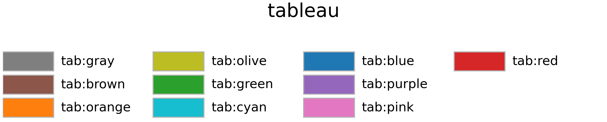
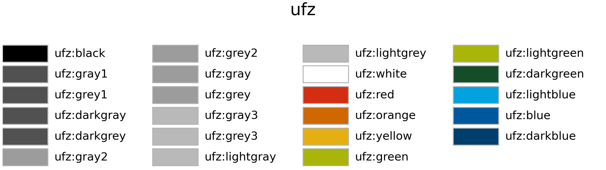
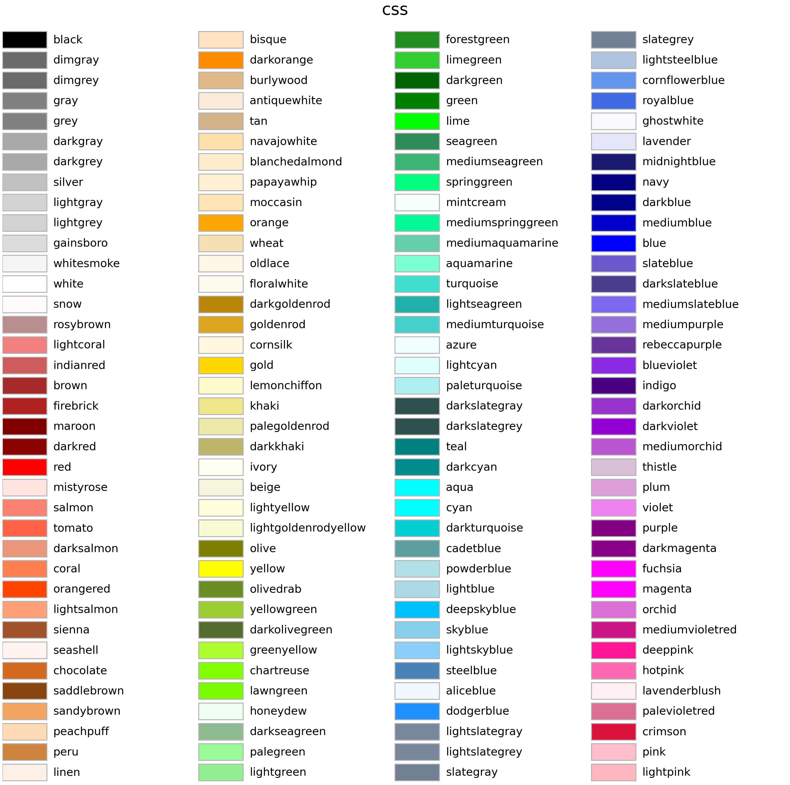
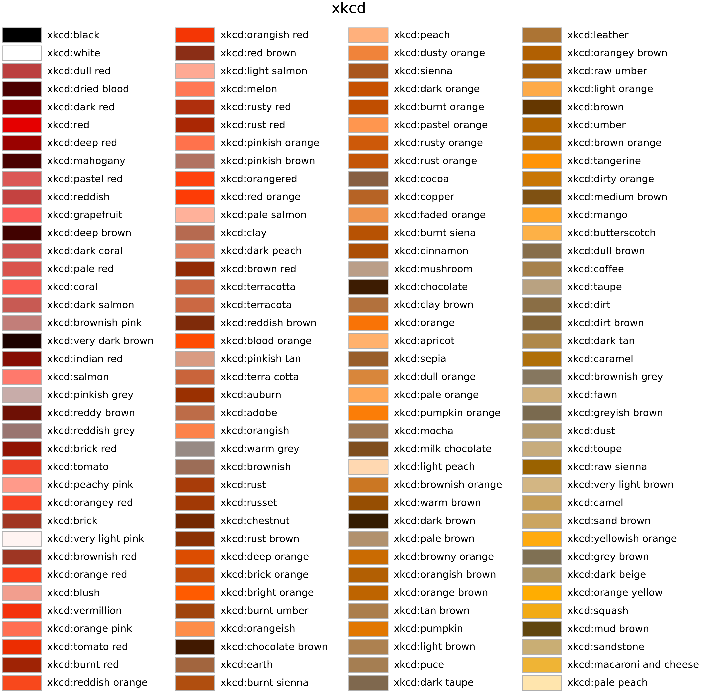
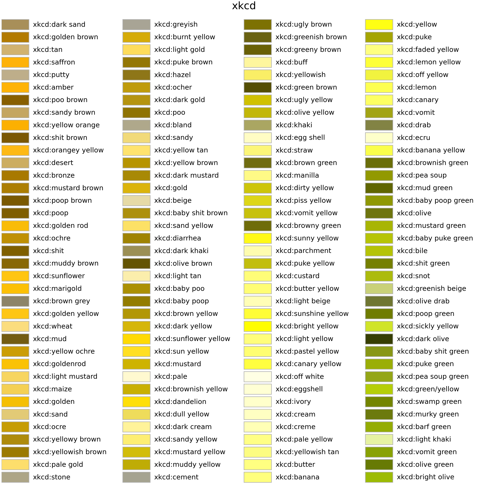
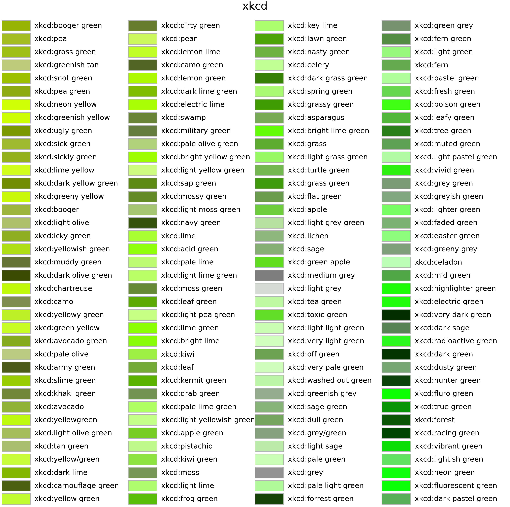
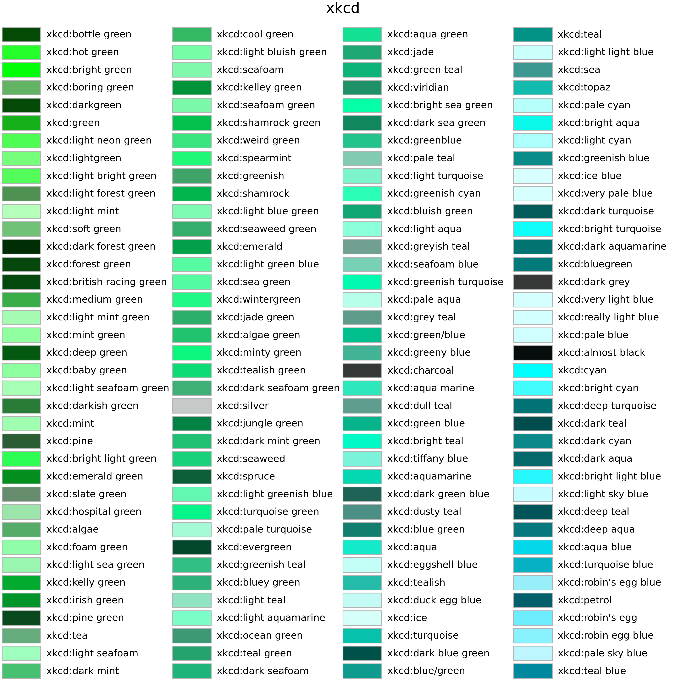
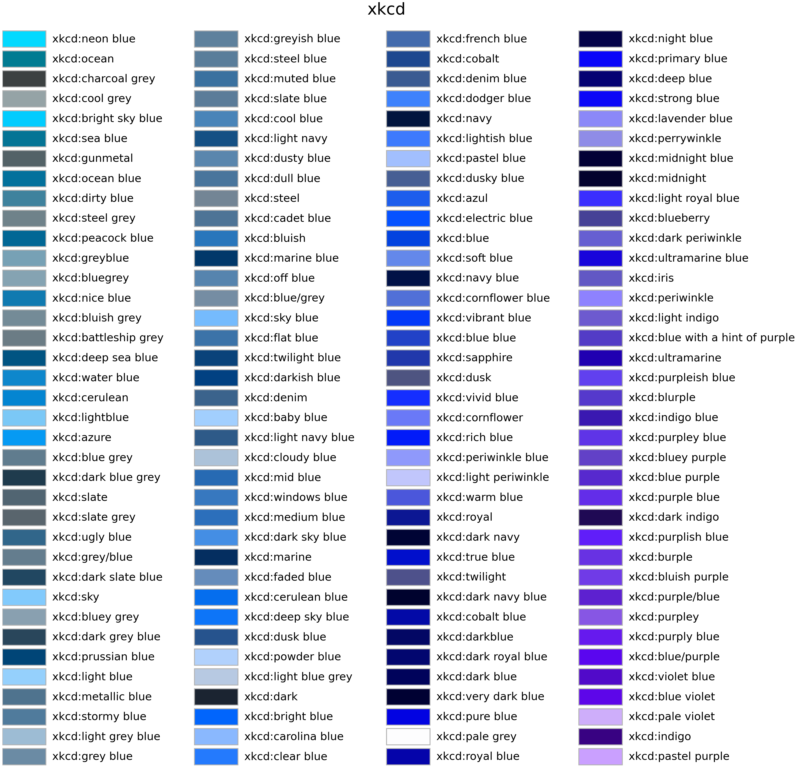
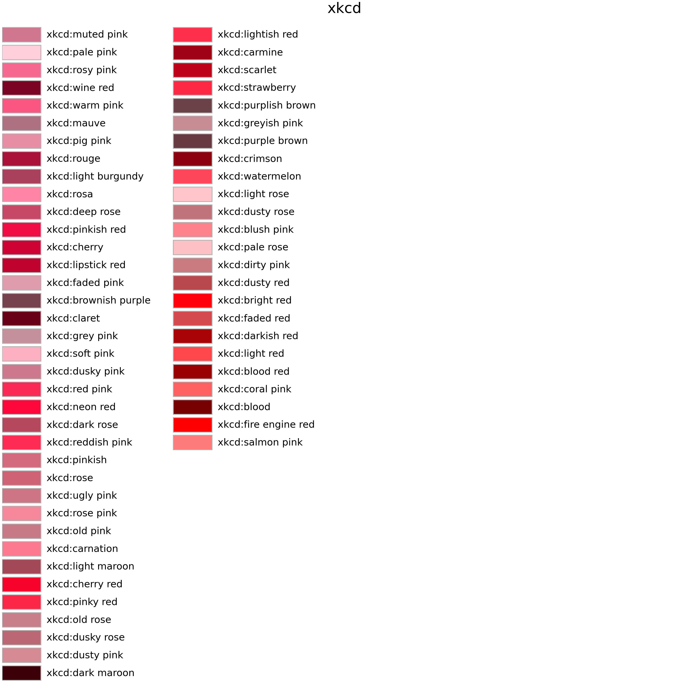
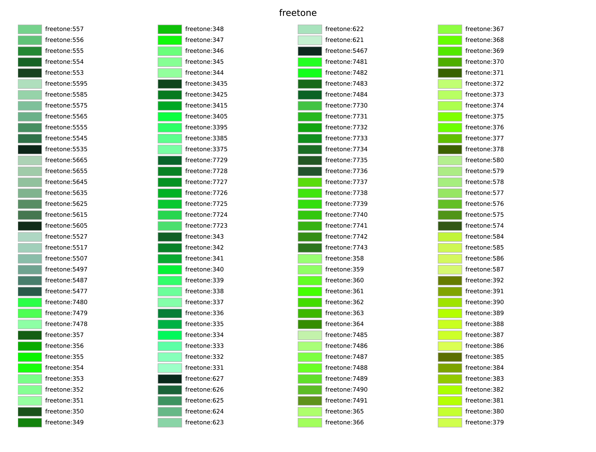

Named Colors
============

:mod:`mcplot` provides a large number of named colors from a variety
of public sources, which can be retrieved with
:func:`mcplot.color.get_color()`.

Next to `Matplotlib`_'s `Base Colors`_, the `Tableau palette`_, the
`CSS Colors`_, and the `XKCD Colors`_, there are `Paul Tol`_'s
qualitative colors named `SRON Colors`_, `Stuart Semple`_'s `Freetone
Colors`_, and the named `UFZ Colors`_ of the `Helmholtz Centre for
Environmental Research`_.

The named colors can be printed with
:func:`mcplot.color.print_colors()` and plotted on screen or into a
file with :func:`mcplot.color.show_colors()` with the categories
`base`, `css`, `freetone`, `sron`, `tableau`, `ufz`, and `xkcd`. A PDF
file with all named colors is given here: `mcplot_colors.pdf`_.

..
   for i in images/mcplot_colors-*.png ; do echo $i ; magick identify ${i} ; done

Base Colors
-----------

Tableau Palette
---------------

SRON Colors
-----------

UFZ Colors
----------

CSS Colors
----------

XKCD Colors
-----------

Freetone Colors
---------------

.. _Helmholtz Centre for Environmental Research: https://www.ufz.de/
.. _Matplotlib: https://matplotlib.org/stable/gallery/color/named_colors.html
.. _Paul Tol: https://personal.sron.nl/~pault/
.. _Stuart Semple: https://culturehustle.com/products/freetone
.. _mcplot_colors.pdf: https://mcuntz.github.io/mcplot/images/mcplot_colors.pdf
