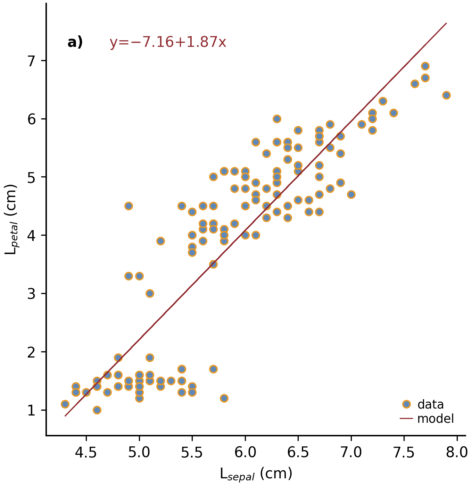

Commented Example
=================

Here is a fully commented example that uses most of the class and
functions of :mod:`mcplot`. It reads a file with `pandas`_ that can be
written as:

.. code-block:: python
		
   import numpy as np
   import pandas as pd

   # Get iris data set for test
   url = "https://raw.githubusercontent.com/uiuc-cse/data-fa14/gh-pages/data/iris.csv"
   df = pd.read_csv(url)

   # Set some data points to missing data
   miss = -9999.
   ndata = df.shape[0]
   rng = np.random.default_rng()
   df.loc[rng.integers(0, ndata, 10), 'sepal_length'] = miss
   df.loc[rng.integers(0, ndata, 10), 'sepal_width'] = miss

   # Write into csv file
   ifile = 'mcplot_iris.csv'
   df.to_csv(ifile, index=False)

Example using mcPlot
--------------------

.. code-block:: python

   # file: mcplot_example.py
   import numpy as np
   import pandas as pd
   from mcplot import mcPlot

   class myPlot(mcPlot):

       #
       # init
       #

       def __init__(self, *args, **kwargs):
           """
           Initialise the instance

           The following methods are called on initialisation of mcPlot:
           * the command line arguments are gathered if at least one of
             the arguments `desc` or `argstr` is given:
             get_command_line_arguments()
           * the output type (self.outtype) is set and additional modules
             are loaded if necessary: set_output_type()
           * standard class variables for layout options, etc. are set:
             set_layout_options()
           * global rcParams are set for Matplotlib using the class variables
             set in set_layout_options(): set_matplotlib_rcparams()
           * the output filename is set, the output file is opened (if required),
             and possible html headers or menus are written: plot_begin()

           """
           super().__init__(*args, **kwargs)
           # Set some user-defined layout options overwriting the defaults
           self.set_extra_layout_options()
           # If plot and layout options were changed, it is a good idea to
           # update the rcParams as well, i.e. set_matplotlib_rcparams()
           # should be called. This sets, for example, the (newly-defined)
           # background color and the like.
           self.set_matplotlib_rcparams()

       #
       # Class variables
       #

       def set_extra_layout_options(self):
           """
           Set some class variables that can be used for plotting.
           Some class variables are used to set more defaults
           in set_matplotlib_rcparams().

           """
           from mcplot.color import get_cmap, get_color

           # Set layout and spaces
           self.nrow = 4       # # of rows of subplots per figure
           self.ncol = 3       # # of columns of subplots per figure
           self.hspace = 0.09  # x-space between subplots
           self.vspace = 0.06  # y-space between subplots
           if self.usetex:
               self.textsize = 12  # standard text size
           else:
               self.textsize = 10  # standard text size

           # Set come line and marker properties
           self.lw = 1.5   # linewidth
           self.ms = 5.0   # marker size
           self.mew = 1.0  # marker edge width

           # Set come colors
           if self.dowhite:
               # delete starting white, black, and pink from palette
               self.mcols = get_cmap('ncl_amwg')[3:]
           else:
               # delete starting white, black, and pink from palette
               self.mcols = get_cmap('mcplot_amwg')[3:]
           self.mcol1 = self.fgcolor       # black or white
           self.mcol2 = self.mcols[-1]     # red
           self.mcol3 = get_color('grey')  # grey
           self.mcol4 = self.mcols[2]      # light blue
           self.mcol5 = self.mcols[-3]     # orange
           self.lcol1 = self.mcol1
           self.lcol2 = self.mcol2
           self.lcol3 = self.mcol3
           self.lcol4 = self.mcol4
           self.lcol5 = self.mcol5
           self.lcols = self.mcols

           # Set legend properties
           self.loc = 'lower right'
           self.xbbox = 1.  # x-data of corner of self.loc
           self.ybbox = 0.  # y-data of corner of self.loc
           self.labelspacing  = 0.2  # spacing between rows in legend
           self.columnspacing = 1.   # spacing between columns in legend
           self.handletextpad = 0.4  # pad between the legend handle and text
           self.handlelength  = 1.0  # length of the legend handles

       #
       # Read data
       #

       def read_data(self):
           """
           The command line arguments are in the list self.cargs.
           This can be used to pass, e.g. filenames to read, etc.

           """
           ifiles = self.cargs
           # Check that only one input file given
           if len(ifiles) != 1:
               raise IOError('Only one input file should be given')
           ifile = ifiles[0]
           # Read DataFrame from mcplot_iris.csv produced in the __main__
           # section, setting self.miss to NaN (from the new command line
           # option -m also added in the __main__ section)
           self.df = pd.read_csv(ifile, na_values=[self.miss])

       #
       # Figure 1
       #

       def plot_fig_1(self):
           import matplotlib.pyplot as plt
           from numpy.polynomial import polynomial as P
           # get dimensions of new Axes for Figure.add_axes
           from mcplot import position
           # convert strings to LaTeX strings
           from mcplot import str2tex
           # put text on plot
           from mcplot import text2plot
           # add a), b), c) to plot
           from mcplot import abc2plot
           # put '(C) YYYY itext' on plot
           from mcplot import signature2plot

           # open new figure, increasing figure counter
           self.ifig += 1
           # iplot is the number of plot within the (nrow, ncol) subplots
           iplot = 0
           # iplot is the panel number used in putting a), b), c), ... on the plot
           iabc = 0
           print(f'  Open figure {self.ifig}')
           fig = plt.figure(self.ifig)

           #
           # Regular panel 1
           #

           # petal_length vs. sepal_length
           iplot += 1
           iabc += 1
           x = self.df['sepal_length']
           y = self.df['petal_length']
           # None = free scaling
           xlim = None
           ylim = None
           # Use raw string for Matplotlib's LaTeX-like notation.
           # str2tex converts into full LaTeX math notation used by
           # matplotlib's usetex keyword. Takes care, for example, that the
           # pdf engine actually uses the full LaTeX notation,
           # e.g. \newline vs. \n in Matplotlib.
           # \textnormal{} is LaTeX and not in Matplotlib so only used
           # if user sets -u, which sets self.usetex = True.
           if self.usetex:
               xlab = str2tex(r'L$_\textnormal{sepal}$ (cm)', usetex=self.usetex)
               ylab = str2tex(r'L$_\textnormal{petal}$ (cm)', usetex=self.usetex)
           else:
               xlab = str2tex(r'L$_{sepal}$ (cm)', usetex=self.usetex)
               ylab = str2tex(r'L$_{petal}$ (cm)', usetex=self.usetex)

           # Make subplots using add_axes.
           # This is equivalent to using subplot with Gridspec.
           # position returns (left, bottom, width, height) in figure coordinates
           # (0-1). The counter `iplot` goes from left to right and from top to
           # bottom, expect if `sortcol=True` where first columns then plots will
           # be filled.
           pos = position(self.nrow, self.ncol, iplot,
                          hspace=self.hspace, vspace=self.vspace)
           ax = fig.add_axes(pos, label=str(iplot))

           # Plot markers. Plot returns list of line2D objects, which is added to
           # larr to collect all line objects for a possible legend.
           larr = []
           tarr = []
           larr += ax.plot(x, y)
           plt.setp(larr[-1], linestyle='None',
                    marker='o', markeredgecolor=self.mcol5,
                    markerfacecolor=self.mcol4,
                    markersize=self.ms, markeredgewidth=self.mew)
           # add a possible legend entry to list tarr
           tarr += [str2tex('data', usetex=self.usetex)]

           # Put a), b), c), ... on plot
           # The panel counter can be upper- or lower letters,
           # arabic or roman number, or `iabc` can be treated as string.
           # The counter can have parentheses, brackets or braces before and
           # after. It can be italic or boldface.
           abc2plot(ax, self.dxabc, self.dyabc, iabc, lower=True, bold=False,
                    parentheses='close', usetex=self.usetex, mathrm=True)
           abc2plot(ax, 3. * self.dxabc, 0.8 * self.dyabc, iabc, upper=True,
                    bold=False, parentheses='open', usetex=self.usetex,
                    mathrm=True)
           abc2plot(ax, 5. * self.dxabc, 0.6 * self.dyabc, iabc, lower=True,
                    bold=True, roman=True, parentheses='both', usetex=self.usetex)
           abc2plot(ax, 7. * self.dxabc, 0.4 * self.dyabc, iabc, upper=True,
                    roman=True, brackets='close', usetex=self.usetex, mathrm=True,
                    italic=True)
           abc2plot(ax, 9. * self.dxabc, 0.2 * self.dyabc, iabc, lower=True,
                    bold=False, braces='both', usetex=self.usetex, mathrm=False)
           abc2plot(ax, 11. * self.dxabc, 0.05 * self.dyabc, f'I am panel {iabc}',
                    string=True, bold=False, braces='both', usetex=self.usetex,
                    mathrm=True, italic=True)

           # Final axes layout
           # Labels set if not empty.
           # Axes limits are only set if not None.
           if xlab != '':
               plt.setp(ax, xlabel=xlab)
           if ylab != '':
               plt.setp(ax, ylabel=ylab)
           ax.grid(False)
           ax.spines['right'].set_color('none')
           ax.spines['top'].set_color('none')
           if xlim is not None:
               plt.setp(ax, xlim=xlim)
           if ylim is not None:
               plt.setp(ax, ylim=ylim)

           #
           # Large Panel 2
           #

           # petal_length vs. petal_width
           iplot += 1
           iabc += 1
           x = self.df['petal_width']
           y = self.df['petal_length']
           xlim = None
           ylim = None
           if self.usetex:
               xlab = str2tex(r'L$_\textnormal{sepal}$ (cm)', usetex=self.usetex)
               ylab = str2tex(r'W$_\textnormal{sepal}$ (cm)', usetex=self.usetex)
           else:
               xlab = str2tex(r'L$_{sepal}$ (cm)', usetex=self.usetex)
               ylab = str2tex(r'W$_{sepal}$ (cm)', usetex=self.usetex)

           # We want to span two figure columns on the same row.
           # Here we do this by hand: get panel coordinates of the next two
           # panels, and combine the distance between the left edges plus the
           # widths to the `rect` (left, bottom, width, height).
           pos1 = position(self.nrow, self.ncol, iplot,
                           hspace=self.hspace, vspace=self.vspace)
           pos2 = position(self.nrow, self.ncol, iplot + 1,
                           hspace=self.hspace, vspace=self.vspace)
           pos = [pos1[0], pos1[1], pos2[0] - pos1[0] + pos2[2], pos1[3]]
           ax = fig.add_axes(pos, label=str(iplot))

           mark1 = ax.plot(x, y)
           plt.setp(mark1, linestyle='None',
                    marker='o', markeredgecolor=self.mcol5,
                    markerfacecolor=self.mcol4,
                    markersize=self.ms, markeredgewidth=self.mew)

           # Put a copyright on the plot '(C) YYYY itext'
           # The text right-aligned by default if not given otherwise
           # (horizontalalignment).
           signature2plot(ax, 0.98, 0.05, 'M Cuntz', usetex=self.usetex,
                          small=True, italic=False, mathrm=False)

           # increase number in (nrow, ncol) subplots because we used two subplots
           iplot += 1

           #
           # Large Panel 3
           #

           iplot += 1
           iabc += 1

           # If you want to have double the figure width (instead of two figure
           # columns), just change the width in `rect`
           pos = position(self.nrow, self.ncol, iplot,
                          hspace=self.hspace, vspace=self.vspace)
           pos[2] = pos[2] * 2.
           ax = fig.add_axes(pos, label=str(iplot))

           # Plot markers
           larr = []
           tarr = []
           larr += ax.plot(x, y)
           plt.setp(larr[-1], linestyle='None',
                    marker='o', markeredgecolor=self.mcol5,
                    markerfacecolor=self.mcol4,
                    markersize=self.ms, markeredgewidth=self.mew)
           tarr += [str2tex('data', usetex=self.usetex)]

           # Add trend line
           xx = x.to_numpy()
           yy = y.to_numpy()
           ii = ~np.isnan(xx)
           xx = xx[ii]
           yy = yy[ii]
           p = P.polyfit(xx, yy, 1)
           pyy = P.polyval(xx, p)
           larr += ax.plot(xx, pyy)
           plt.setp(larr[-1], linestyle='-', linewidth=self.lw / 2.,
                    marker='None', color=self.mcol2)
           tarr += [str2tex('model', usetex=self.usetex)]

           # Write equation on plot
           # to have correct minus symbol
           s0 = r'$-$' if p[0] < 0 else ''
           s1 = r'$-$' if p[1] < 0 else '+'
           noteq = rf'y={s0}{abs(p[0]):.2f}{s1}{abs(p[1]):.2f}x'
           # # Another possibility is to set the whole equations in $...$
           # # but this uses more space and the second sign still has to be
           # # chosen beforehand.
           # s1 = '-' if p[1] < 0 else '+'
           # teq = str2tex(rf'$y={p[0]:.2f}x{s1}{abs(p[1]):.2f}$',
           #               usetex=self.usetex)
           #
           # Put the equation as text on plot
           # One can set one of the sizes xxsmall, xsmall, small, medium, large,
           # xlarge, xxlarge to True. Also bold and italic can be set to true.
           # All other keywords will be passed to Matplotlib's Axes.text() such
           # as `color` here.
           # You can either use a string such as noteq and set usetex=True
           text2plot(ax, self.dxabc, self.dyabc, noteq, color=self.mcol2,
                     small=True, usetex=self.usetex)
           # or you can transform noteq to a LaTeX string first using str2tex
           teq = str2tex(noteq, usetex=self.usetex)
           # and then put in on the plot without usetex.
           text2plot(ax, self.dxabc, 0.8 * self.dyabc, teq, color=self.mcol2,
                     small=True)

           # Add legend using the two list of lines (larr) and text (tarr)
           # loc and bbox_to_anchor behave slightly different for different
           # fontsizes.
           ll = ax.legend(larr, tarr,
                          frameon=self.frameon, ncol=1,
                          labelspacing=self.labelspacing,
                          handletextpad=self.handletextpad,
                          handlelength=self.handlelength,
                          columnspacing=self.columnspacing,
                          loc=self.loc,
                          bbox_to_anchor=(self.xbbox, self.ybbox),
                          scatterpoints=1, numpoints=1,
                          fontsize='small')

           # Final axes layout
           if xlab != '':
               plt.setp(ax, xlabel=xlab)
           if ylab != '':
               plt.setp(ax, ylabel=ylab)
           ax.grid(False)
           ax.spines['right'].set_color('none')
           ax.spines['top'].set_color('none')
           if xlim is not None:
               plt.setp(ax, xlim=xlim)
           if ylim is not None:
               plt.setp(ax, ylim=ylim)

           # increase subplot number
           iplot += 1

           #
           # Large Panel 4
           #

           iplot += 1
           iabc += 1

           # One can also imagine different numbers of rows and columns,
           # so that the panel will have a different size.
           # This is done in the example for axis margins in Matplotlib's gallery
           # https://matplotlib.org/stable/gallery/subplots_axes_and_figures/axes_margins.html
           # For example, half the number of rows will give double the height
           # of a panel. iplot has to be adjusted accordingly.
           pos = position(self.nrow // 2, self.ncol, iplot - self.ncol + 1,
                          hspace=self.hspace, vspace=self.vspace)
           ax = fig.add_axes(pos, label=str(iplot))

           # Plot markers
           mark1 = ax.plot(x, y)
           plt.setp(mark1, linestyle='None',
                    marker='o', markeredgecolor=self.mcol5,
                    markerfacecolor=self.mcol4,
                    markersize=self.ms, markeredgewidth=self.mew)

           # iabc has till the right count
           abc2plot(ax, self.dxabc, self.dyabc, iabc, upper=True, bold=True,
                    parentheses='both', usetex=self.usetex, mathrm=True)

           # Final axes layout
           if xlab != '':
               plt.setp(ax, xlabel=xlab)
           if ylab != '':
               plt.setp(ax, ylabel=ylab)
           ax.grid(False)
           ax.spines['right'].set_color('none')
           ax.spines['top'].set_color('none')
           if xlim is not None:
               plt.setp(ax, xlim=xlim)
           if ylim is not None:
               plt.setp(ax, ylim=ylim)

           # Show plot or write it into file, adding a link to the image file into
           # a possible html file.
           self.plot_save(fig)

       #
       # Figure 2
       #

       def plot_fig_2(self):
           import matplotlib.pyplot as plt
           from numpy.polynomial import polynomial as P
           from mcplot import position
           from mcplot import str2tex
           from mcplot import text2plot
           from mcplot import abc2plot

           # new figure
           self.ifig += 1
           iplot = 0
           iabc = 0
           print(f'  Open figure {self.ifig}')
           fig = plt.figure(self.ifig)

           #
           # One big panel
           #

           # petal_length vs. sepal_length
           iplot += 1
           iabc += 1
           x = self.df['sepal_length']
           y = self.df['petal_length']
           xlim = None
           ylim = None
           if self.usetex:
               xlab = str2tex(r'L$_\textnormal{sepal}$ (cm)', usetex=self.usetex)
               ylab = str2tex(r'L$_\textnormal{petal}$ (cm)', usetex=self.usetex)
           else:
               xlab = str2tex(r'L$_{sepal}$ (cm)', usetex=self.usetex)
               ylab = str2tex(r'L$_{petal}$ (cm)', usetex=self.usetex)

           # We make one panel spanning two rows and two columns by hand.
           # First panel in the upper left corner
           pos1 = position(self.nrow, self.ncol, iplot,
                           hspace=self.hspace, vspace=self.vspace)
           # The second panel is one row down and one column to the right
           pos2 = position(self.nrow, self.ncol, iplot + self.ncol + 1,
                           hspace=self.hspace, vspace=self.vspace)
           # `rect` (left, bottom, width, height)
           pos = [pos1[0], pos2[1],  # left from panel 1, bottom from panel 2
                  pos2[0] - pos1[0] + pos2[2],  # height
                  pos1[1] - pos2[1] + pos1[3]]  # width
           ax = fig.add_axes(pos, label=str(iplot))

           # Plot markers
           larr = []
           tarr = []
           larr += ax.plot(x, y)
           plt.setp(larr[-1], linestyle='None',
                    marker='o', markeredgecolor=self.mcol5,
                    markerfacecolor=self.mcol4,
                    markersize=self.ms, markeredgewidth=self.mew)
           tarr += [str2tex('data', usetex=self.usetex)]

           # Add trend line
           xx = x.to_numpy()
           yy = y.to_numpy()
           ii = ~np.isnan(xx)
           xx = xx[ii]
           yy = yy[ii]
           p = P.polyfit(xx, yy, 1)
           pyy = P.polyval(xx, p)
           larr += ax.plot(xx, pyy)
           plt.setp(larr[-1], linestyle='-', linewidth=self.lw / 2.,
                    marker='None', color=self.mcol2)
           tarr += [str2tex('model', usetex=self.usetex)]

           # Equation on plot
           s0 = r'$-$' if p[0] < 0 else ''
           s1 = r'$-$' if p[1] < 0 else '+'
           noteq = rf'y={s0}{abs(p[0]):.2f}{s1}{abs(p[1]):.2f}x'
           text2plot(ax, 3. * self.dxabc, self.dyabc, noteq, color=self.mcol2,
                     medium=True, usetex=self.usetex)

           # a), b), c), ...
           abc2plot(ax, self.dxabc, self.dyabc, iabc, lower=True, bold=True,
                    parentheses='close', usetex=self.usetex, mathrm=True)

           # Legend
           ll = ax.legend(larr, tarr,
                          frameon=self.frameon, ncol=1,
                          labelspacing=self.labelspacing,
                          handletextpad=self.handletextpad,
                          handlelength=self.handlelength,
                          columnspacing=self.columnspacing,
                          loc=self.loc,
                          bbox_to_anchor=(self.xbbox, self.ybbox),
                          scatterpoints=1, numpoints=1,
                          fontsize='small')

           # Axes layout
           if xlab != '':
               plt.setp(ax, xlabel=xlab)
           if ylab != '':
               plt.setp(ax, ylabel=ylab)
           ax.grid(False)
           ax.spines['right'].set_color('none')
           ax.spines['top'].set_color('none')
           if xlim is not None:
               plt.setp(ax, xlim=xlim)
           if ylim is not None:
               plt.setp(ax, ylim=ylim)

           # increase subplot number
           iplot += self.ncol + 1

           # Save fig
           self.plot_save(fig)

   #
   # Main
   #

   if __name__ == '__main__':
       import argparse

       #
       # Extra command line argument -m to be called as:
       #     -m '-9999' or --missing=-9999
       # The parser must have `add_help=False`!
       miss = -9999.
       parser = argparse.ArgumentParser(add_help=False)
       parser.add_argument('-m', '--missing', action='store',
                           default=miss, dest='miss', type=float,
                           metavar='missing_value',
                           help=(f'Data treated as missing value in'
                                 f' input file (default: {miss}).'))

       #
       # New instance of myPlot. This also gets the command line arguments,
       # to be called for example as:
       #     python mcplot_example.py -t pdf -o ex.pdf mcplot_iris.csv
       desc = 'Full commented example of mcPlot'
       argstr = 'input_file'
       iplot = myPlot(desc, argstr, parents=parser)

       #
       # Reading data
       # read the input file given on the command line
       iplot.read_data()

       #
       # Plot
       iplot.plot_fig_1()

       #
       # Another figure, PNG file, or PDF page
       iplot.plot_fig_2()

       #
       # Finish
       # close any open plot files
       iplot.close()

This script can be called from the command line given
**mcplot_iris.csv** as the argument, opening on screen windows:

.. code-block:: bash

   python mcplot_example.py mcplot_iris.csv

plot into a PDF file **mcex.pdf**:

.. code-block:: bash

   python mcplot_example.py -t pdf -o mcex.pdf mcplot_iris.csv

save PNG files **mcex_0001.png** and **mcex_0002.png**:

.. code-block:: bash

   python mcplot_example.py -t png -o mcex_ mcplot_iris.csv

save the PNG files with a black background (and white foreground) in
high resolution:

.. code-block:: bash

   python mcplot_example.py -t png -o mcex_ -w --dpi 600 mcplot_iris.csv

The test PNG files (with transparent background) give:

and:

.. _pandas: https://pandas.pydata.org/
